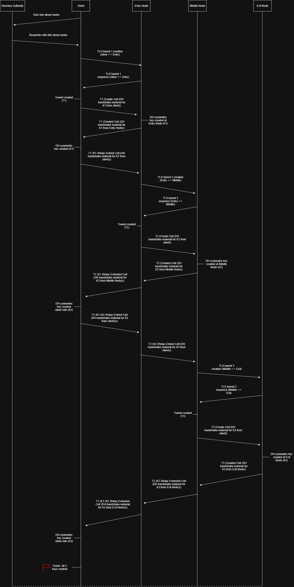

# TOR Key Exchange (Work in Progress)

🚧 **Work in Progress (WIP):**  
This is just me learning and exploring how a TOR-like key exchange might work.  
It’s something I found interesting and wanted to map out for research and educational purposes.  

---

## Diagram

---

## Notes
- This is **not an official TOR design** — just my own attempt to understand and visualize the process.  
- The diagram shows how symmetric keys (K1, K2, K3) could be established step by step between the client and different nodes.  
- I’m sharing this because it helped me learn, and maybe it’ll help others too.  

⚠️ **Disclaimer:**  
This is **for research and educational purposes only**.  
It is **not production-ready code** or a finalized protocol.  
Use at your own risk.
